# ErgoDashEnclosedCase
An enclosed, layer cut case for the ErgoDash

This is an enclosed Ergodash case inspired by the original sandwich style case plates and my experience with building digital gaming controllers.

I designed it because I wanted my keyboard to be fully enclosed, and the standard sandwich plates do not do that. There were 3d printed case options available, but that didn't seem like it would meet the quality or aesthetic I was going for. And it seemed like they didn't really plan for an aluminum switch plate, which is definitely something I wanted.

This repository primarily covers the case assembly, with a small section about mounting the PCB to the switch plate rather than having it be held on by friction or soldered switches (see [PCB Mounting Aside](#pcb-mounting-aside)). For details on the main PCB assembly, please refer to the original build guide available in [the ErgoDash repository](https://github.com/omkbd/ErgoDash)

## Tools Needed

- Drill w/ countersink bit
- Screwdriver
- File/Sandpaper/Buffing pad/etc. (see [Prep](#prep))
## Parts

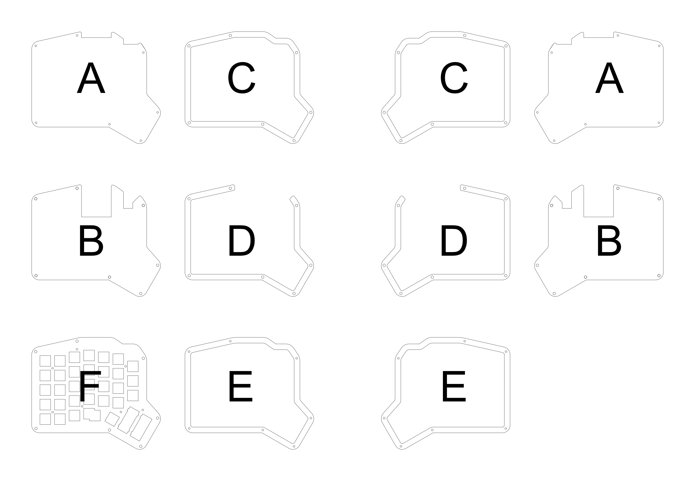
The case consists of 8 layers per half made up of 6 unique parts. (image above for reference). In addition to the necessary parts, there are some optional parts for those who wish to secure the PCB to the switch plate.

For both halves, you will need:

(A) Bottom Panel - x2
(B) Bottom Panel w/ TRS+ProMicro slot - x2
(C) Rim w/ standoff holes - x4
(D) Rim w/ Front Cutout - x4
(E) Rim w/ Screw holes - x2
(F) Switchplate - x2
m2 x 8mm countersunk or flat top screw - x28
m2 x 12mm standoff post

Optional:
m2 x 4mm flat top screw - x28
m2 x 4mm standoff post - x14
6.5mm Outer Diameter m2 washer - x28 (I 3d printed these out of PETG, as all m2 washers I could find had a 5mm OD, which is the same size at the hole in the PCB. Printing them out of of plastic also servers to electrically isolate the PCB from the aluminum switch plate. STL and STEP files for this washer can be found in the release files)

The switch plate is intended to be made out of 1.6mm laser cut aluminum. The rest of the layers are intended to be made out of 3mm laser cut acrylic. I ordered these panels from [Ponoko](https://www.ponoko.com/). They are a good option if you are in the US, but any laser cutter should do the trick.

Please note - if you choose to use a matte acrylic like I did, many companies only coat one side with the matte coating. If this is true for your supplier as it was for me and you want both halves to show the matte side symmetrically, you'll need to order the layers for each half separately with mirrored files so the correct side will have the matte coating. This increases cost but is only necessary in the case of one-side coated acrylics. This is the sole reason that there are "left" and "right" half files in this repository - other than being mirrored, they are identical.

## Prep

To have screws sit flush with the top and bottom of the case, we'll need to drill in countersinks. This should be done in **the bottom layer and the rim layer with the smaller holes**. I recommend leaving the paper on while doing this, going slow and carefully, and regularly checking the countersink depth against a sample screw. When done, all screws should sit flush, looking something like this.

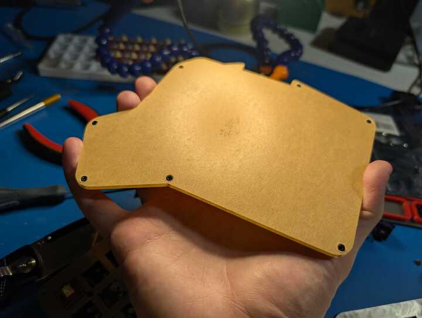

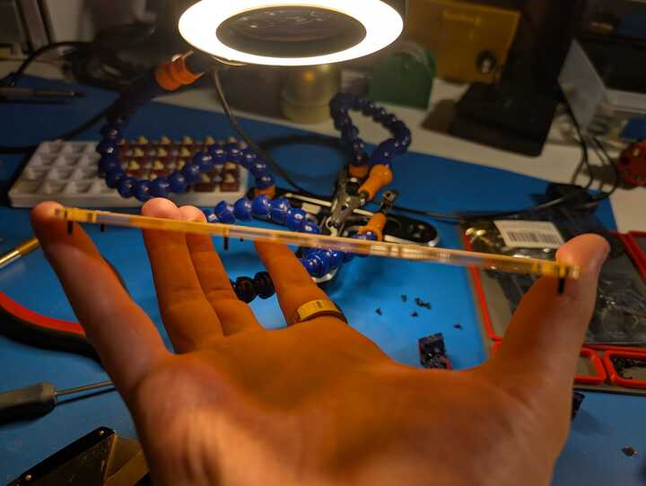

I also recommend doing some post processing on the aluminum panel. I used a Dremel with 240 grit and 400 grit buffing wheels to deburr the edges and smooth out the switch cutouts, but a file would work as well. you could probably get away with not doing this, but expect the switch plate to tear up your switch housings.

## PCB Mounting Aside

The default sandwich style case (and seemingly many other open source keyboards) relies on the PCB to be fastened to the switch plate via the switches. This doesn't provide a lot of strength for the PCB mounting solution. It can work alright for directly soldered switches despite putting
all forces between the two directly on the solder joints, but it particularly unreliable for hot swap installations. 

So for this case design, the option to reuse the holes in the switch plate that were originally intended to secure the case together to mount the PCB and the switch plate. These holes are of 5mm diameter, the same as most m2 washers. Therefore, I designed a custom 6.5mm outer diameter water that I could 3D print. It looks like this.

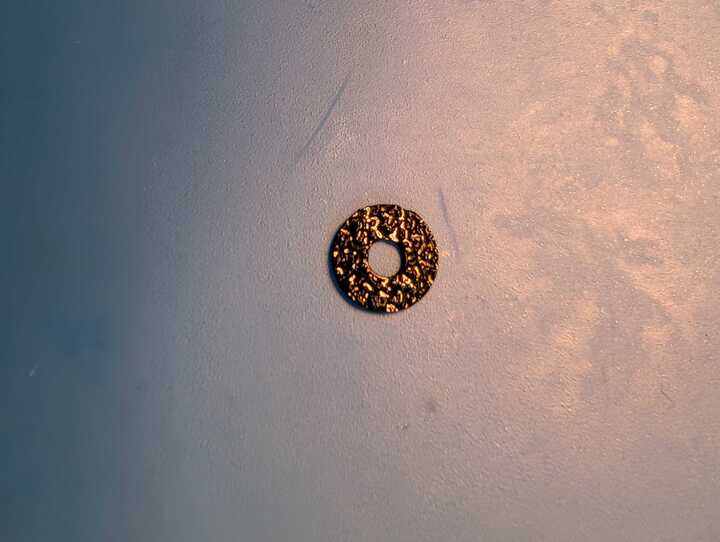

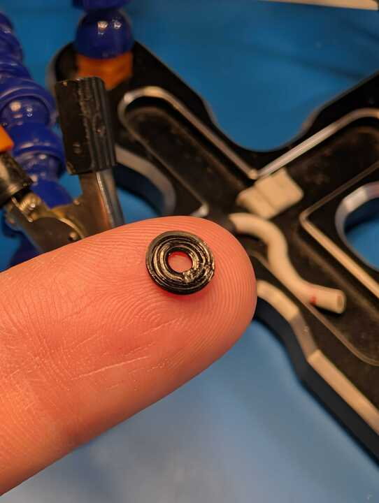

These need to be installed on either side of the PCB, between both the m2x4mm screw on the bottom of the PCB and the m2x4mm spacer on the top of the PCB. See various views of this in the following images

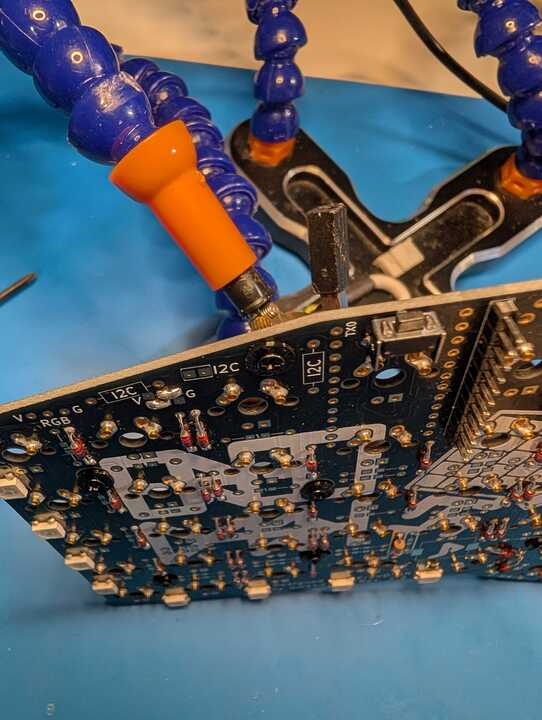

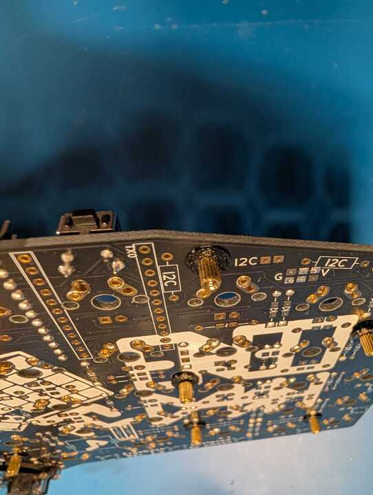

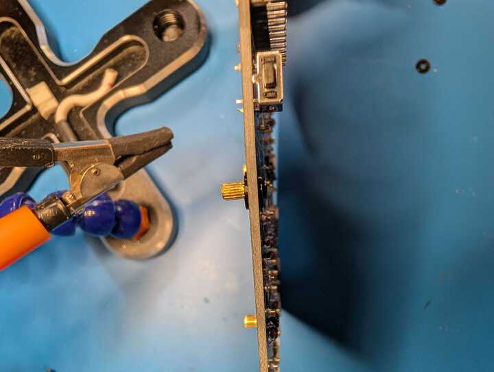

Lastly, fasten the PCB and switch plate together with more m2x4mm screws. This will robustly fasten the PCB and switch plate together and should look like this:

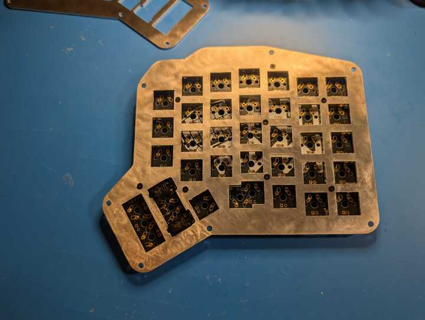

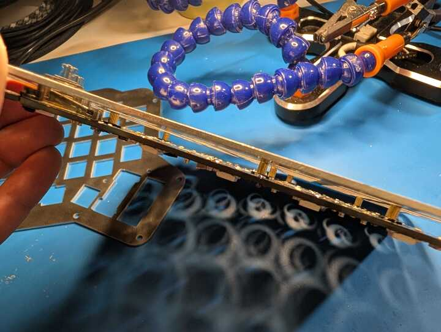

## Main Assembly

Insert all of the switches into the switch plate/PCB. If you installed mill-max hotswap sockets on your PCB, make sure the switches are correctly installed. If not, solder all of the switches in at this point (followed by the Pro Micro). 

While stacking up the layers, I recommend removing the protective paper as you go rather than all at once to prevent dust from settling between the layers. From top to bottom, the layers stack as such:

E
C
F
C
D
D
B
A

Place m2x8mm screws through the bottom panel, loosely threading the m2x12mm spacers on the other side (do not tighten it all the way to the bottom panel, or the top screw will not be able to reach). Then stack each of the layers in order. Once you reach the top layer, make sure each layer is carefully aligned and secure it all together with more m2x8mm screws.

## Done!

If you followed all of these steps, you should have a fully assembled, enclosed ErgoDash case. Add keycaps and cables and you've got a full setup. Here's how mine came out. If you built on yourself, please share it with me (@prilosac on X/Twitter)

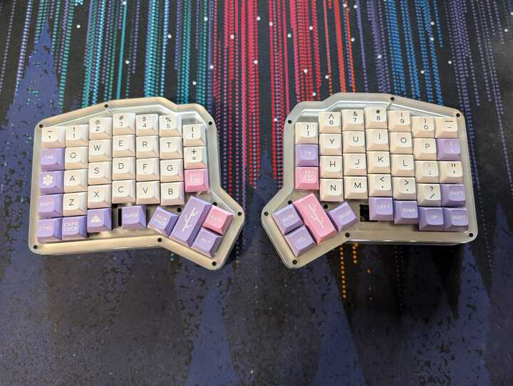

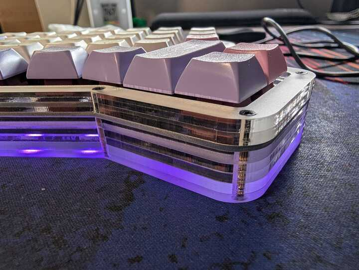

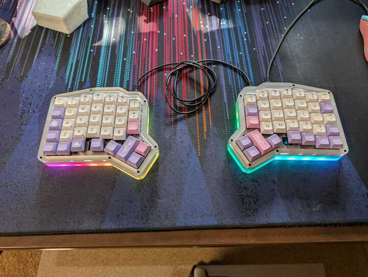
